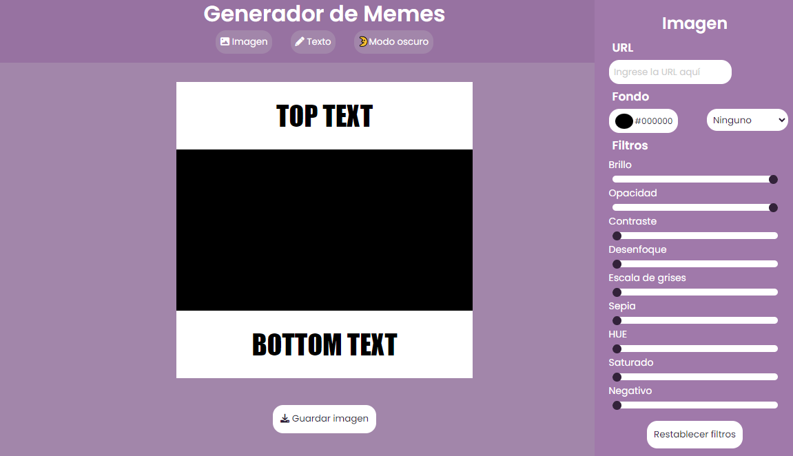
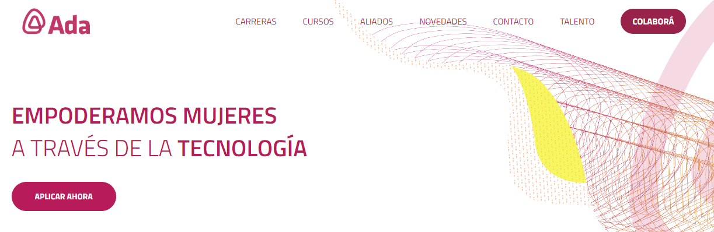

# Proyecto Editor de Memes
## Extracto
👨‍💻 Es es segundo proyecto que realizo en el marco del curso de ADA ITW, incorporamos las siguientes tecnologías. 

#### ✅CSS
#### ✅HTML5
#### ✅JavaScript

## Proyecto
[Clic aquí para visitar mi página](https://bejaranolidia.github.io/Editor-de-Memes/)
>

## ADA ITW  
[Clic aquí para ver más acerca de ADA ITW](https://adaitw.org/)
>
